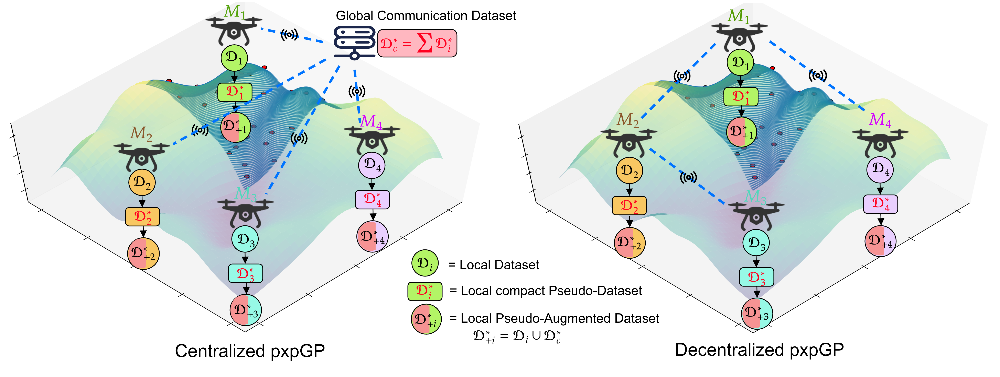

# Distributed Gaussian Processes



<!-- **Maintained by:** Sanket A Salunkhe  
**Contact details:** Sanket (sanket_salunkhe@mines.edu), George (george.kontoudis@mines.edu) -->

In this work, we propose the **Proximal Inexact Pseudo Gaussian Process (pxpGP)**, a distributed GP training framework designed for large-scale centralized and decentralized multi-robot networks. Beyond scalability, pxpGP ensures data privacy by exchanging only pseudo-datasets among agents, rather than raw observations.

**Contribution**:

1. We extend sparse variational inference technique to generate compact pseudo-datasets, significantly improving the informativeness of shared data and enabling scalability to larger network sizes. These pseudo-datasets also preserve local data privacy, facilitating federated learning through inter-agent collaboration without sharing raw observations.

2. pxpGP is formulated as scaled proximal-inexact consensus ADMM algorithm initialized with warm-start hyperparameters and adaptive residual balancing. This leads to faster convergence and reduces the number of communication rounds. 

<!-- -------------------------------------------------------------------------------------- -->

## Results

### Hyperparameter Accuracy Estimation

**Centralized pxpGP with 16k dataset**


**Centralized pxpGP with 32k dataset**


**Decentralized dec-pxpGP with 16k dataset**


**Decentralized dec-pxpGP with 32k dataset**


### Prediction Performance on real-world NASA SRTM dataset

**Prediction accuracy of the proposed pxpGP and dec-pxpGP frameworks across fleet size 𝑀 = (16, 49, 64, 100) using a training dataset of size N = 30,000 equally distributed among agents and a test dataset size 𝑁𝑡𝑒𝑠𝑡 = 300 per agent, compared with the baseline models (gapxGP and dec-gapxGP) on the SRTM dataset.**


<!-- -------------------------------------------------------------------------------------- -->

## Experimental Setup

### Python virtual environment setup

```
python3 -m venv gpenv
source gpenv/bin/activate
pip3 install -r gpenv_requirements.txt
```

*All parameters related to GP models training is located inside `config` folder. While related datasets are given in `dataset` folder. After successful exection, results will be stored in json file inside `results` folder.*


<!-- -------------------------------------------------------------------------------------- -->


## Centralized multi-agent GP Training
#### cGP (Centralized Consensus GP)
```
torchrun --nproc_per_node=2 --master_addr=localhost --master_port=12345 cGP_train.py
```
<!-- 
Or
```
python3 -m torch.distributed.launch --nproc_per_node=2 --master_addr=localhost --master_port=12345 cgp_train.py
``` -->

#### apxGP (Centralized Approximate Proximal GP)
```
torchrun --nproc_per_node=2 --master_addr=localhost --master_port=12345 apxGP_train.py
```

#### gapxGP (Centralized Generalized Approximate Proximal GP)
```
torchrun --nproc_per_node=2 --master_addr=localhost --master_port=12345 gapxGP_train.py
```

#### pxpGP (Centralized Pseudo Approximate Proximal GP) (*Proposed method)
```
torchrun --nproc_per_node=2 --master_addr=localhost --master_port=12345 gapxGP_train.py
```

## Decentralized multi-agent GP Training
#### dec_cGP 

```
torchrun --nproc_per_node=4 --master_addr=127.0.0.1 --master_port=29500 dec_cGP_train.py 
```

#### dec_apxGP

```
torchrun --nproc_per_node=4 --master_addr=127.0.0.1 --master_port=29500 dec_apxGP_train.py 
```

#### dec_gapxGP
```
torchrun --nproc_per_node=4 --master_addr=127.0.0.1 --master_port=29500 dec_gpxGP_train.py 
```

#### dec_pxpGP
```
torchrun --nproc_per_node=4 --master_addr=127.0.0.1 --master_port=29500 dec_pxpGP_train.py 
```


Where,

1. `nproc_per_node` : No of agent in system
2. `master_addr` :  IP address of central node
3. `master_port` : Port ID of central node


### Run on HPC

Use slurm file to write commands and run using following command:
```
sbatch ./scratch/gaussian_processes/results/scripts/run_100.slurm
```
Check result/script for reference slurm and bash script.

It's advisible to run inside tmux session:


### Datasets

Dataset 1-5: Synthetic dataset generated using generative GP models \
Dataaset 6-8: Real world elevation dataset from NASA SRTM 


<!-- -------------------------------------------------------------------------------------- -->

## Citation
If you use this code in your research, please cite:

```bibtex
@inproceedings{salunkhe2026federated,
  title={Federated Gaussian Process Learning via Pseudo-Representations for Large-Scale Multi-Robot Systems},
  author={Salunkhe, Sanket and Kontoudis, George P},
  booktitle={International Conference on Autonomous Agents and Multiagent Systems (AAMAS)},
  year={2026},
  doi={10.65109/YQEA8075}
}
```

Sanket A. Salunkhe, George P. Kontoudis, “Federated Gaussian Process Learning via Pseudo-Representations for Large-Scale Multi-Robot Systems,” International Conference on Autonomous Agents and Multiagent Systems (AAMAS), Paphos, Cyprus, 2026.
